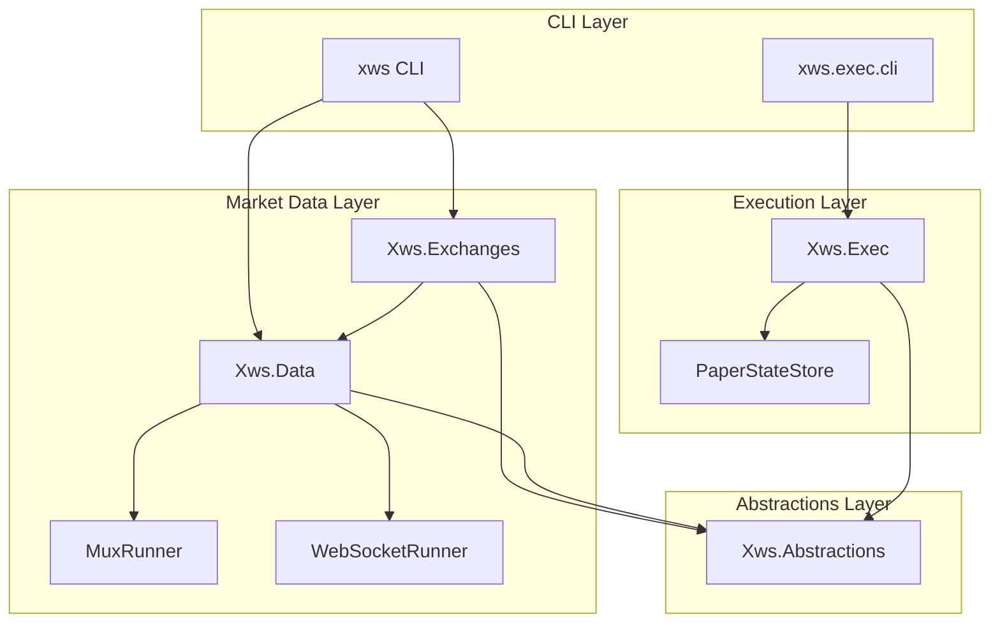
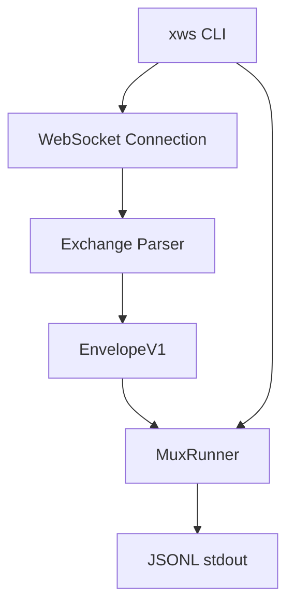
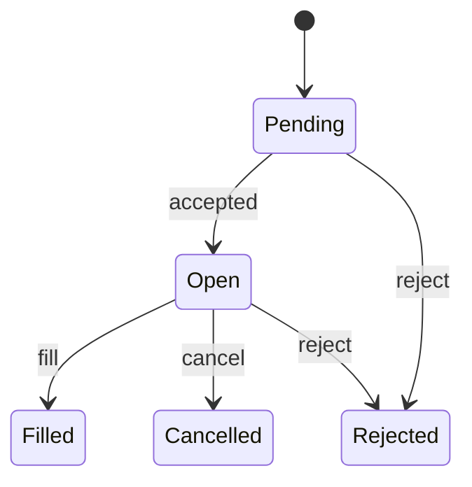

# Architecture

## Overview
`xws` is a .NET 8 CLI and library set for exchange WebSocket market data ingestion and (paper/testnet/mainnet) execution workflows. The system is library-first with clean separation of concerns:

- `Xws.Abstractions`: Shared interfaces and contracts (IExchangeAdapter, IWebSocketClient, IMessageParser, IJsonlWriter).
- `Xws.Data`: Market data runtime (mux runner, WebSocket clients, JSONL formatting).
- `Xws.Exchanges`: Exchange adapter implementations (Hyperliquid, OKX, Bybit, MEXC).
- `xws`: Thin CLI for market data subscriptions.
- `Xws.Exec`: Execution library (paper/testnet/mainnet order management).
- `xws.exec.cli`: Thin CLI for execution commands.

## Module Diagram


## Data Flow


## Interfaces
- `IExchangeAdapter`: encapsulates exchange-specific subscription and parsing behaviors.
- `IWebSocketClient`: minimal WebSocket interface for exchange clients.
- `IMessageParser`: exchange message-to-envelope conversion.
- `IExecutionClient`: execution surface for place/cancel/amend/query operations.

## Execution State Machine


## Dependency Graph

**No Circular Dependencies** (resolved in M11 via Xws.Abstractions)

```
Xws.Exchanges → Xws.Data → Xws.Abstractions
                ↓
             xws CLI

Xws.Exec → Xws.Abstractions
    ↓
xws.exec.cli
```

## Repository Structure (Key Paths)

### Abstractions
- `src/Xws.Abstractions/IExchangeAdapter.cs`
- `src/Xws.Abstractions/IWebSocketClient.cs`
- `src/Xws.Abstractions/IMessageParser.cs`
- `src/Xws.Abstractions/IJsonlWriter.cs`

### Market Data
- `src/Xws.Data/Core/Mux/` - Multi-exchange muxing logic
- `src/Xws.Data/Core/Output/` - JSONL formatting
- `src/Xws.Data/Core/WebSocket/` - Generic WebSocket client

### Exchange Adapters
- `src/Xws.Exchanges/Hyperliquid/` - Hyperliquid adapter (WebSocket, REST, parsing)
- `src/Xws.Exchanges/Okx/` - OKX adapter
- `src/Xws.Exchanges/Bybit/` - Bybit adapter
- `src/Xws.Exchanges/Mexc/` - MEXC adapter (includes Protobuf definitions)

### Execution
- `src/Xws.Exec/Exchanges/{HL,OKX,Bybit}/` - Exchange-specific execution clients
- `src/Xws.Exec/Shared/State/` - Paper trading state management
- `src/Xws.Exec/Shared/Models/` - Order, position, and execution models

### CLI
- `src/xws/Commands/` - Market data CLI commands
- `src/xws.exec.cli/Commands/` - Execution CLI commands

### Tests
- `tests/Xws.Data.Tests/` - Market data runtime tests
- `tests/Xws.Exchanges.Tests/` - Exchange adapter tests
- `tests/Xws.Exec.Tests/` - Execution logic tests
