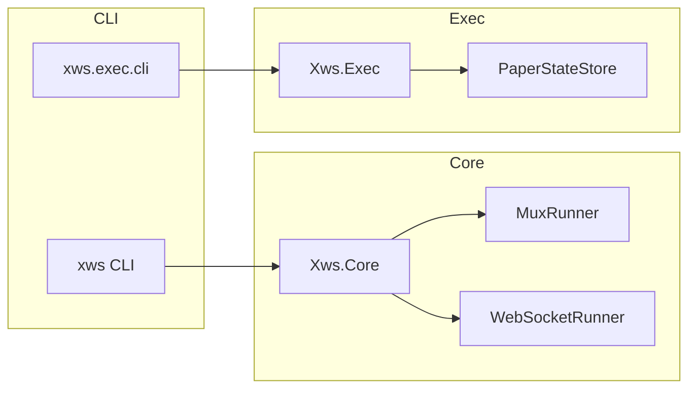
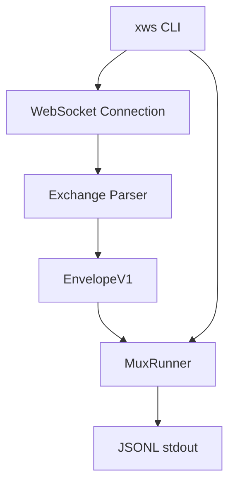
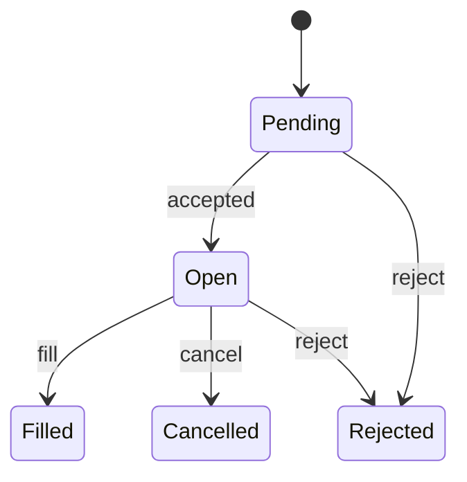

# Architecture

## Overview
`xws` is a .NET 8 CLI and library set for exchange WebSocket market data ingestion and (paper/testnet/mainnet) execution workflows. The system is library-first:
- `Xws.Core` provides exchange adapters, muxing, envelope serialization, and WebSocket runners.
- `xws` is a thin CLI that wires commands to `Xws.Core`.
- `Xws.Exec` provides execution abstractions and paper-state handling.
- `xws.exec.cli` is a thin CLI over `Xws.Exec`.

## Module Diagram

## Data Flow

## Interfaces
- `IExchangeAdapter`: encapsulates exchange-specific subscription and parsing behaviors.
- `IWebSocketClient`: minimal WebSocket interface for exchange clients.
- `IMessageParser`: exchange message-to-envelope conversion.
- `IExecutionClient`: execution surface for place/cancel/amend/query operations.

## Execution State Machine

## Repository Structure (Key Paths)
- `src/Xws.Core/Exchanges/{HL,OKX,Bybit,MEXC}/WebSocket/`
- `src/Xws.Core/Shared/Interfaces/`
- `src/Xws.Exec/Exchanges/{HL,OKX,Bybit}/`
- `src/Xws.Exec/Shared/State/`
- `src/xws/Commands/`
- `src/xws.exec.cli/Commands/`
